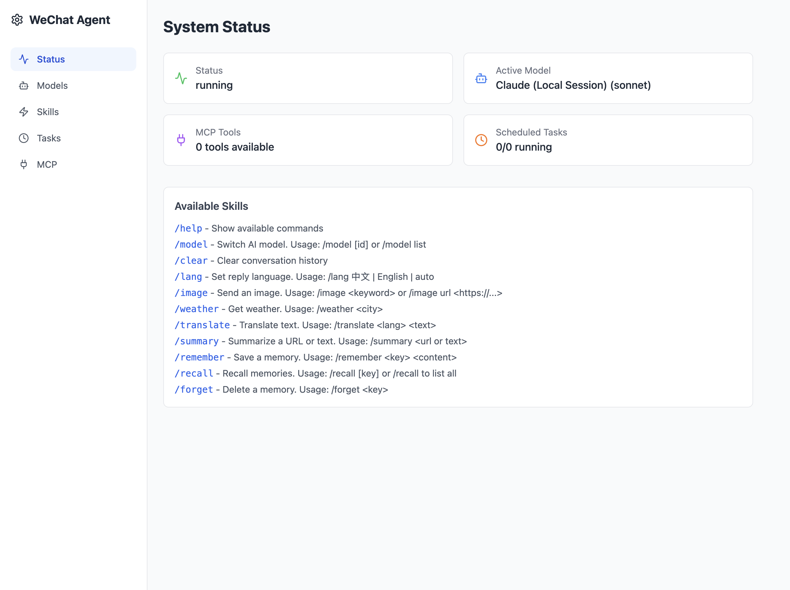
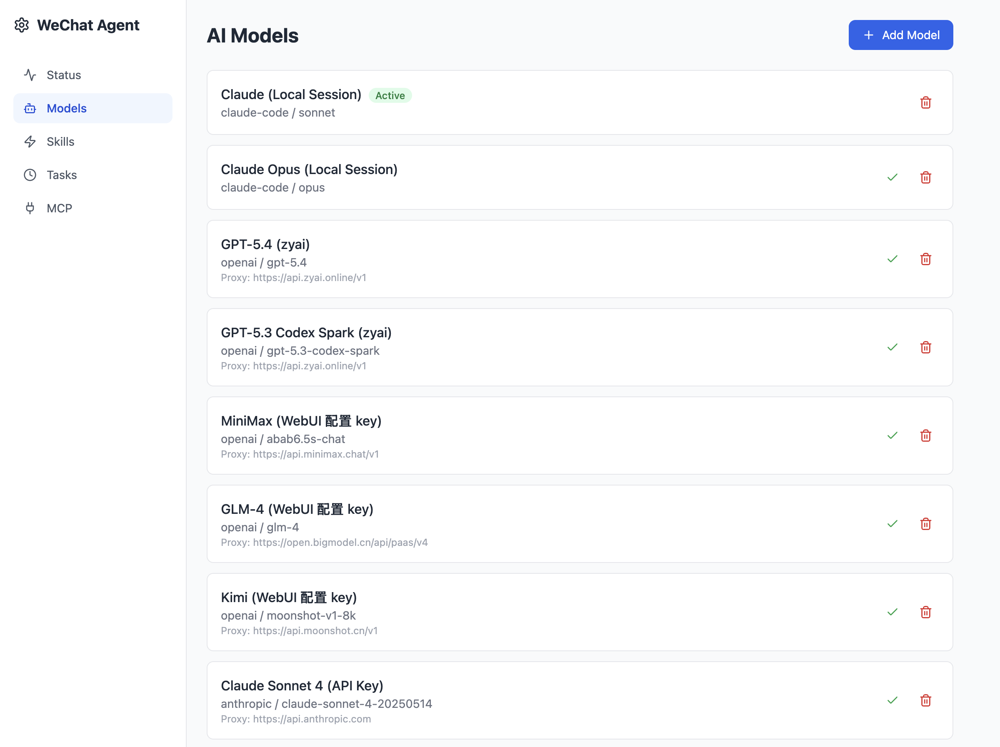
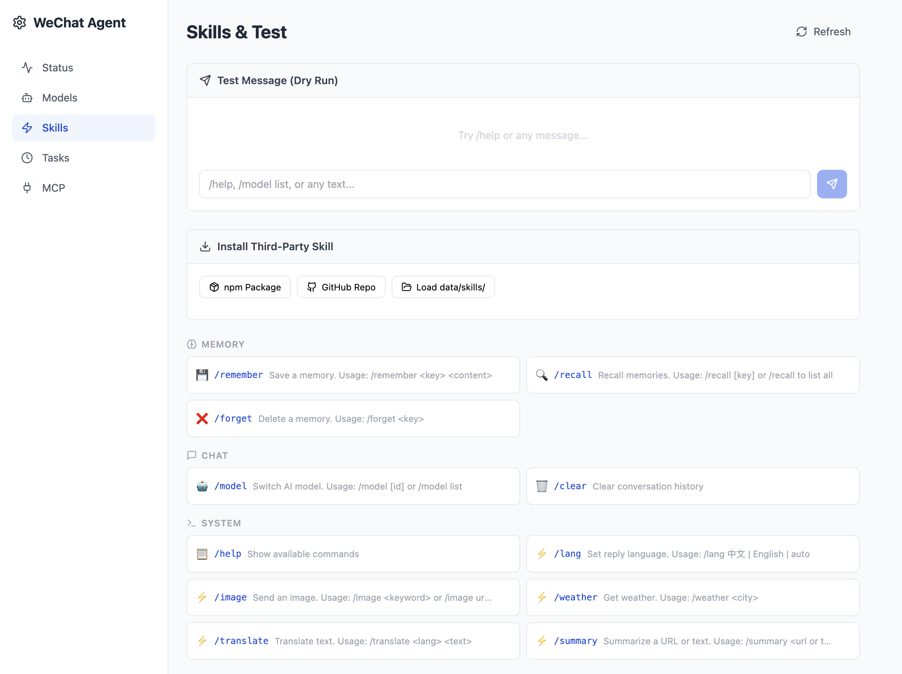
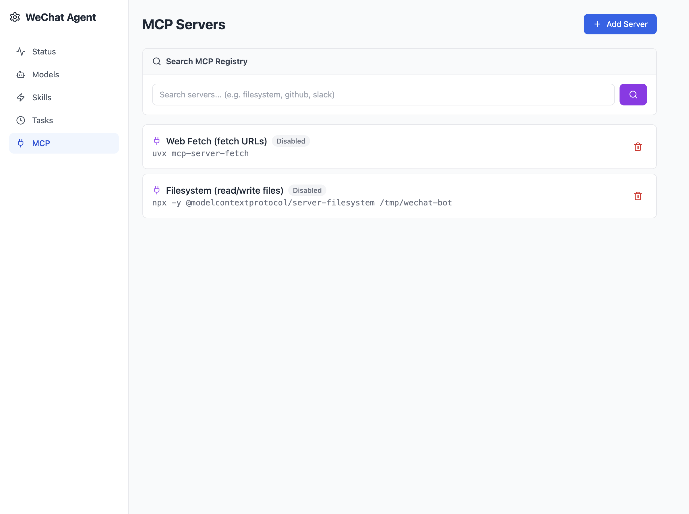

<div align="center">

# WeChat Agent Bot

### **your AI, in WeChat.**

Multi-model AI assistant for WeChat with WebUI, Skills, MCP tools, and persistent memory.

[](https://github.com/ChenYCL/wechat-agent-bot)
[](LICENSE)
[](https://nodejs.org)
[](tests/)
[](https://github.com/ChenYCL/wechat-agent-bot/pulls)

[简体中文](#简体中文) | [English](#english)

**Supported Providers**

[](https://openai.com)
[](https://anthropic.com)
[](https://docs.anthropic.com/en/docs/claude-code)
[](https://moonshot.cn)
[](https://open.bigmodel.cn)

<br />

[Quick Start](#-quick-start) · [Features](#-features) · [Screenshots](#-screenshots) · [Commands](#-wechat-commands) · [Deploy](#-production-pm2)

</div>

---

<a name="english"></a>

## The Problem

You want an AI assistant **in WeChat** — but existing solutions require servers, complex deployment, or are locked to one model. Switching between GPT-4o and Claude means running two bots.

## The Solution

**WeChat Agent Bot** connects WeChat to any AI model through a simple local install. One `npm install`, scan a QR code, done. Switch models with `/model`, remember context across restarts, extend with Skills and MCP tools.

|  | Without this | With WeChat Agent Bot |
|--|-------------|----------------------|
| **Multi-model** | One bot per model | `/model kimi` to switch instantly |
| **Memory** | Lost on restart | SQLite — permanent, survives restarts |
| **Extensibility** | Hard-coded | 11 Skills + MCP ecosystem + npm/GitHub plugins |
| **Management** | Edit config files | WebUI at `localhost:3210` |
| **Deployment** | Complex | `./setup.sh && npm run pm2:start` |

---

## Features

- **Multi-model** — OpenAI / Anthropic / Claude Code (local session) / Kimi / GLM / MiniMax + any OpenAI-compatible API
- **Relay/Proxy** — per-model `baseUrl` for API relay services
- **Claude Code integration** — reuse your local Claude Code subscription, no API key needed
- **Stream mode** — enabled by default for faster responses
- **WebUI dashboard** — manage models, skills, tasks, MCP servers from browser
- **11 built-in Skills** — image search, weather, translate, summarize, memory, language preference
- **SQLite persistence** — conversation history + user memories stored permanently in `data/bot.db`
- **Scheduled tasks** — cron-based, auto-send research reports etc.
- **MCP tools** — search MCP registry, one-click install
- **Third-party plugins** — load custom Skills from npm / GitHub / local directory
- **One-command setup** — `./setup.sh` auto-installs Node.js, Python, PM2, all deps
- **Security** — API auth, CORS restriction, input validation, key masking, prototype pollution protection

---

## Screenshots

| Status | Models |
|:---:|:---:|
|  |  |

| Skills & Test | MCP Servers |
|:---:|:---:|
|  |  |

---

## Quick Start

### 1. Install

```bash
git clone https://github.com/ChenYCL/wechat-agent-bot.git
cd wechat-agent-bot

# One-command setup (auto-installs Node.js 22+, PM2, builds WebUI)
./setup.sh
```

### 2. Configure

```bash
vim .env
```

```env
OPENAI_API_KEY=sk-xxx
OPENAI_BASE_URL=https://api.openai.com/v1   # or your relay URL
OPENAI_MODEL=gpt-4o
```

> **Relay service**: Users without direct API access can use [zyai.online](https://api.zyai.online/register/?aff_code=Xj4T) — supports OpenAI / Claude / GPT-5, set `baseUrl` to `https://api.zyai.online/v1`.

### 3. Start

```bash
npm run dev    # Development (auto-reload)
```

Scan the QR code with WeChat. Done.

```
✅ Connected to WeChat!
WebUI running at http://localhost:3210
```

---

## Three Usage Modes

**Mode 1: Third-party API Key** (recommended for standalone deployment)
```env
OPENAI_API_KEY=sk-xxx
OPENAI_BASE_URL=https://api.openai.com/v1
```

**Mode 2: Claude Code Local Session** (reuse your subscription)
```json
{ "provider": "claude-code", "model": "sonnet", "apiKey": "local" }
```

**Mode 3: Chinese models** (Kimi / GLM / MiniMax — all OpenAI-compatible)
```json
{ "provider": "openai", "model": "moonshot-v1-8k", "baseUrl": "https://api.moonshot.cn/v1" }
```

---

## WeChat Commands

| Command | Description |
|---|---|
| `/help` | List all commands |
| `/model list` | Show available models |
| `/model <id>` | Switch model |
| `/lang 中文` | Set reply language |
| `/image cat` | Search & send image |
| `/weather Beijing` | Weather (free API) |
| `/translate English 你好` | Translate via AI |
| `/summary https://...` | Summarize URL or text |
| `/remember name Alice` | Save memory |
| `/recall` | List all memories |
| `/forget name` | Delete memory |
| `/clear` | Clear conversation |

---

## Architecture

```
WeChat Message → weixin-agent-sdk → MessageRouter
  ├─ /command → SkillRegistry → Built-in or third-party Skill
  └─ text → MemoryManager (inject context) → ProviderRegistry
       ├─ OpenAIProvider (stream)
       ├─ AnthropicProvider (stream)
       └─ ClaudeCodeProvider (local CLI session)
  → Response sent back to WeChat
```

```
wechat-agent-bot/
├── src/
│   ├── index.ts               # Entry point
│   ├── core/                   # Bot lifecycle, router, types
│   ├── providers/              # OpenAI, Anthropic, Claude Code
│   ├── skills/                 # 11 built-in + dynamic loader
│   ├── scheduler/              # Cron task manager
│   ├── mcp/                    # MCP protocol client
│   ├── config/                 # JSON config persistence
│   ├── server/                 # Express API + WebUI static
│   └── utils/                  # SQLite store, logger
├── webui/                      # React + Tailwind SPA
├── tests/                      # 69 tests (unit + E2E + WeChat integration)
├── data/                       # Runtime: bot.db, config.json, logs/
├── ecosystem.config.cjs        # PM2 config
└── setup.sh                    # One-command installer
```

---

## Production (PM2)

```bash
# Start (background, auto-restart on crash)
npm run pm2:start

# View logs
npm run pm2:logs

# Status / restart / stop
npm run pm2:status
npm run pm2:restart
npm run pm2:stop

# Auto-start on boot
pm2 startup && pm2 save
```

| Config | Value | Note |
|---|---|---|
| Log path | `data/logs/out.log` | stdout |
| Error log | `data/logs/error.log` | stderr |
| Auto-restart | On | 5s delay, max 10 retries |
| Memory limit | 500MB | Auto-restart on exceed |

### Data Directory

```
data/
├── bot.db          # SQLite (conversation history + memories, permanent)
├── config.json     # Runtime config (models, tasks, MCP)
├── logs/           # PM2 logs
├── media/          # Image cache
└── skills/         # Third-party skill installs
```

---

## Development

```bash
npm run test          # Unit tests (23)
npm run test:e2e      # E2E tests (46, includes WeChat mock server)
npm run test:all      # All 69 tests
npm run dry-run       # Terminal chat without WeChat
npm run webui:dev     # WebUI dev server (port 5173)
```

---

## API Endpoints

| Method | Path | Description |
|---|---|---|
| GET | `/api/status` | System status |
| GET/POST | `/api/models` | Model CRUD |
| POST | `/api/models/:id/activate` | Set active model |
| GET/POST | `/api/skills` | Skill management |
| POST | `/api/skills/install-npm` | Install skill from npm |
| POST | `/api/skills/install-github` | Install skill from GitHub |
| GET/POST | `/api/tasks` | Scheduled task CRUD |
| GET/POST | `/api/mcp` | MCP server management |
| GET | `/api/mcp/search?q=` | Search MCP registry |
| POST | `/api/status/test-message` | Dry-run message test |
| GET | `/api/config` | Config (keys masked) |

---

## FAQ

**Q: Do I need to upgrade WeChat?**
No. The SDK uses OpenClaw long-polling protocol. Any WeChat that can scan QR codes works.

**Q: Do I need a public server?**
No. Long-polling mode, runs locally.

**Q: Will conversations survive restarts?**
Yes. All data is permanently stored in `data/bot.db` (SQLite).

**Q: How to use API relay/proxy?**
Set `baseUrl` in model config to your relay address.

**Q: How to deploy to production?**
`npm run pm2:start` + `pm2 startup && pm2 save` for auto-start on boot. Logs in `data/logs/`.

**Q: How to backup/migrate?**
Copy the entire `data/` directory. That's it.

---

<a name="简体中文"></a>

## 简体中文

微信 AI 智能助手 — 一键安装，多模型切换，WebUI 配置，定时任务，记忆系统，MCP 工具集成。

基于 [weixin-agent-sdk](https://github.com/wong2/weixin-agent-sdk)（OpenClaw 协议），本地 `npm install` 即可运行。

### 快速开始

```bash
git clone https://github.com/ChenYCL/wechat-agent-bot.git
cd wechat-agent-bot
./setup.sh              # 一键安装（自动装 Node.js 22+、PM2、构建 WebUI）
vim .env                # 填入 API Key
npm run dev             # 开发模式启动，扫码连接微信
npm run pm2:start       # 生产模式（后台运行）
```

### 功能亮点

- **多模型** — OpenAI / Anthropic / Claude Code / Kimi / GLM / MiniMax
- **中转代理** — 每个模型可配独立 baseURL
- **11 个内置技能** — 图片搜索、天气、翻译、摘要、记忆、语言偏好
- **SQLite 持久化** — 对话历史 + 用户记忆永久存储
- **WebUI 管理** — 浏览器管理模型、技能、定时任务、MCP
- **第三方扩展** — npm / GitHub / 本地目录加载自定义 Skill
- **MCP 集成** — 搜索注册表一键安装工具
- **PM2 部署** — 后台运行、自动重启、开机自启

> **推荐中转**：没有海外 API 的用户可使用 [zyai.online](https://api.zyai.online/register/?aff_code=Xj4T) 中转服务，支持 OpenAI / Claude / GPT-5 等主流模型。

### 微信命令

| 命令 | 说明 |
|---|---|
| `/help` | 查看所有命令 |
| `/model list` | 列出模型 |
| `/model <id>` | 切换模型 |
| `/lang 中文` | 设置回复语言 |
| `/image <关键词>` | 搜索图片发送 |
| `/weather <城市>` | 查天气 |
| `/translate <语言> <文本>` | 翻译 |
| `/summary <URL>` | 网页摘要 |
| `/remember <key> <内容>` | 保存记忆 |
| `/recall` | 查看记忆 |
| `/forget <key>` | 删除记忆 |
| `/clear` | 清空对话 |

---

## License

[MIT](LICENSE) © [ChenYCL](https://github.com/ChenYCL)
